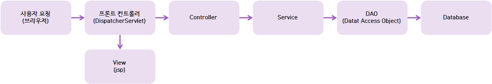
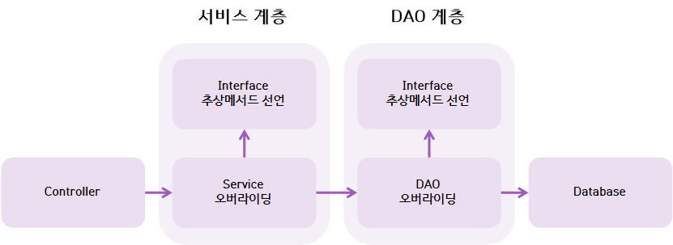
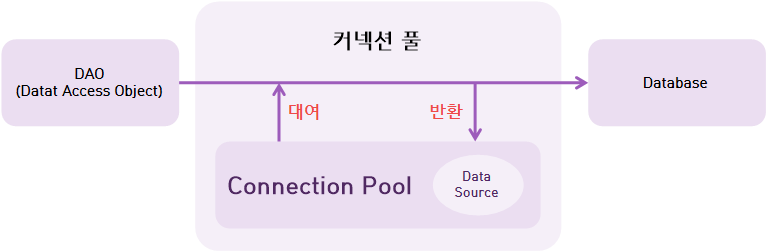
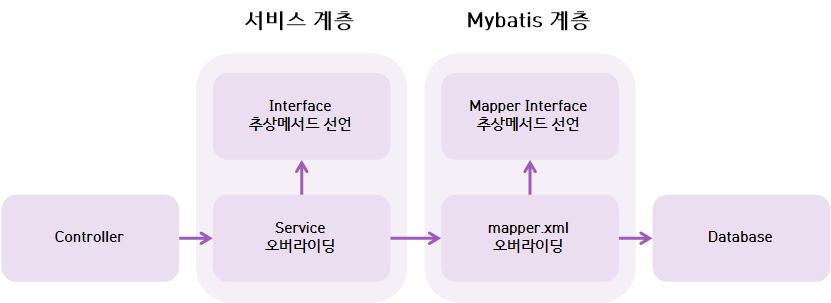

# Spring
spring framework ⚙

## 목차
* [여는 말](#여는-말)
* [개요](#개요)
	* [스프링 프레임워크란?](#스프링-프레임워크란)
	* [스프링 프레임워크의 특징](#스프링-프레임워크의-특징)
* [DI와 IoC](#DI와-IoC)
	* [의존 객체 자동 주입](#의존-객체-자동-주입)
* [스프링 MVC 프레임워크의 동작 구조](#동작-구조)
* [구동 과정 정리](#구동-과정-정리)
* [스프링 조립](#스프링-조립)
	* [JSP에 Maven을 이용해 스프링 조립하기](#JSP에-Maven을-이용해-스프링-조립하기)
* [스프링 MVC Controller 객체 구현](#스프링-MVC-Controller-객체-구현(5강))
	* [@Controller](#Controller)
	* [RequestMapping을 이용한 url 맵핑](#2-RequestMapping을-이용한-url-맵핑)
		* [Controller의 화면 처리](#Controller의-화면-처리)
	* [요청 파라미터를 통한 HTTP 전송 정보 얻기](#요청-파라미터를-통한-HTTP-전송-정보-얻기)
		* [전통적 방식](#전통적-방식)
		* [어노테이션 사용](#어노테이션-사용)
		* [커멘드 객체 사용](#커멘드-객체-사용)
	* [Model 전달자](#Model-전달자)
* [스프링 MVC 웹서비스](#스프링-MVC-웹서비스)
* [스프링 MVC 웹 서비스(JDBC)](#스프링-MVC-웹-서비스-JDBC)
	* [Connection Pool과 DataSource](#Connection-Pool과-DataSource)
	* [DB 구축](#DB-구축)
* [MyBatis](#MyBatis)
* [프로젝트 준비사항](#프로젝트-준비사항)
	* [롬복](#1.-롬복)
	* [타일즈 뷰 템플릿](#2.-타일즈-뷰-템플릿)
	

    
21.06.11
## 여는 말
### 스프링 웹 프로젝트는 두 가지 방식
* 참고) https://developsd.tistory.com/68
* Spring starter project : Spring Boot를 이용하는 프로젝트
	* 최소한의 개발을 해야 하는 경우 사용
* Spring regacy project : 스프링 템플릿 프로젝트를 이용하는 프로젝트
	* 가장 기본이 되는 스프링 프레임워크
	* 설정 작업이 조금 복잡하지만 실제 개발 업무에서 많이 사용하는 방식
	* boot에 비해 내용이 방대하다
	* xml로 작성
	* ex) 전자 정부 프레임워크(Spring regacy 버전 3 사용)
* 두개가 완전히 다른 건 아니다

## 개요
### 스프링 프레임워크란?
* 프레임워크 : 뼈대를 이루는 코드 묶음
* 방향성을 제시하고, 원하는 기능을 빠르게 만들 수 있게 한다
* 라이브러리랑 다르다, 라이브러리가 모인 전체적인 큰 묶음이 프레임워크
	* 라이브러리 = 모듈 : 프레임워크 안에 미리 만들어져 있는 기능
* 스프링 프레임워크의 주요 기능 : DI, AOP, MVC, JDBC 등 제공

### 스프링 프레임워크의 특징
#### 1. POJO(Plain Old Java Object) 기반의 프레임워크
* 자바 객체의 라이프사이클을 스프링 컨테이너가 직접 관리
* 스프링 컨테이너로부터 필요한 객체를 얻어올 수 있다
* getter, setter 같이 기본적인 기능만 가진 자바 객체
* 상속받아 사용하는 것이 아니라 어노테이션을 통해 객체를 주입 받는다
* 이렇게 작성하면 클래스 간의 결합도가 낮아져 다른 솔루션으로 변경할 때 어노테이션만 변경하면 되므로 유지 보수에 있어 좀 더 유용하게 활용할 수 있다.
* 참고) https://velog.io/@galaxy/Spring%EC%9D%98-%EA%B8%B0%EB%B3%B8-%ED%8A%B9%EC%A7%95-POJO   

#### 2. DI(Dependency Injection, 의존성 주입)을 지원
* 각 계층, 서비스, 객체 사이의 의존성이 존재할 경우 스프링 프레임워크가 연결시킨다
* 클래스 간의 약한 결합을 가능케 한다
* 주입? 외부에서 객체를 생성해서 넣어주는 것
* DI는 의존성을 분리시켜 사용한다    

#### 3. AOP(Aspect Oriented Programming)을 지원
* 관점 지향 프로그래밍
* 로직을 기준으로 핵심 관점과 부차 관점으로 나누어 그 관점을 기준으로 각각 모듈화하겠다는 것
* 트랜잭션, 로깅, 보안 등 여러 모듈에서 공통적으로 지원하는 기능을 분리해 사용할 수 있다.    

#### 4. 확장성이 높다
* 스프링 프레임워크의 소스는 모두 라이브러리로 분리시켜져 있어서 필요한 라이브러리만 가져다 쓸 수 있다.    

#### 5. Model2 방식의 MVC Framework를 지원


### 스프링 프레임워크 모듈
 
### 스프링 컨테이너 (IoC) - Core Container
* 스프링에서 제공하고 있는 모듈 중 spring-core는 DI와 IoC를 제공한다
* 객체를 생성하고 조립하고, **컨테이너를 통해 생성된 객체를 Bean이라고 부른다**
* IoC : Inversion of Control (제어의 역전)
	* 객체를 필요할 때 생성해서 사용하던 방식을 **객체를 미리 생성해놓고 꺼내서 사용한다**

### Maven
* 원격에 있는 라이브러리를 네트워크를 통해 다운받을 수 있게 하는 플랫폼
* pom.xml은 메이븐 설정 파일로, 메이븐은 라이브러리를 연결해주고 빌드를 위한 플랫폼이다
* 메이븐을 사용하면 라이브러리를 작성해서 바로 사용할 수 있다

### 실습
* 의존성 주입을 실습하려면, Main에서 SpringTest 객체를 직접 생성하지 않고 스프링 설정 파일을 이용한다 - xml
* Java 파일에서 new 연산자를 사용하지 않고 xml 문서를 이용한다
* xml에서 bean을 선언한 다는 것은 new로 객체를 선언하는 것과 같은 의미를 갖는다
```java
<bean id="객체 이름" class="java 파일 경로" />
```
#### bean의 범위(scope)
* singleton, prototype
* 스프링은 기본적으로 모든 bean을 singleton으로 생성해 관리한다
* singleton : 스프링 컨테이너에서 생성된 bean은 동일한 타입에 대해 한 개만 생성되고, getBean() 메소드로 호출될 때 동일한 객체가 반환된다
* prototype : 하나의 bean에 대해 여러개의 객체가 존재할 수 있다, 싱글톤과 반대되는 개념
	* 설정 파일에서 bean을 정의할 때 scope 속성을 명시해주어야 한다
	* <bean id="id" class="class" scope="prototype" />


## DI와 IoC
* 스프링은 DI와 IoC를 강력하게 지원하는 프레임워크이다
* 그래서 스프링을 DI Framework 또는 IoC Framework라고 부른다
* DI는 IoC 패턴의 구현 방법 중 하나이다
* DI에 따라 프로그램의 흐름이 완전히 변경된다
* 스프링 컨테이너에 만들어둔 각종 클래스(bean)들은 서로 의존적이다
* 의존적이다? 객체 안에 객체가 저장된다

### DI 설정 방법
* 2가지 의존성 주입 방법
```xml
// 1. 생성자를 통한 의존성 주입
<bean id="chef" class="ex02.Chef" />

<bean id="hotel" class="ex02.Hotel">
	<constructor-arg ref="chef" />
</bean>

// 2. setter를 통한 의존성 주입
<bean id="dev" class="ex03.DatabaseDev">
	<property name="url" value="데이터베이스 주소" />
	<property name="uid" value="데이터베이스 아이디" />
	<property name="upw" value="데이터베이스 비밀번호" />
</bean>

<bean id="dao" class="ex03.MemberDAO">
	// bean을 값으로 주입할 때는 ref 속성을 이용한다
	<property name="dev" ref="dev" />
</bean> 
```
   
21.06.14
### 의존 객체 자동 주입
* 스프링 컨테이너가 자동으로 의존 대상 객체를 찾아서 의존 대상 객체가 필요한 객체에 주입해 주는 기능
* 어노테이션을 이용해 쉽게 구현할 수 있다
* 스프링 컨텍스트의 참조가 필요하다 <context:annotation-config />
#### 구현 방법 
* @Au**to**wired(required = false)
	* 주입하려고 하는 객체의 타입이 일치하는 객체를 자동으로 주입한다
	* **타입**을 기준으로 의존성 주입
	* 같은 타입의 bean이 두개 이상 있으면 **이름**으로 bean을 찾음
	* *생성자, setter, 멤버변수*에 적용 가능
	* required = false 속성
		* 스프링은 주입할 bean이 없으면 에러를 발생시키는데, 이 때 이를 무시하고 넘어가는 속성이다
		* **단, 기본 생성자가 반드시 필요하다**
		* 값이 없는데 부르면 null point error 가 발생한다.
	* spring annotation
* @Qualifier : 모호한 빈의 강제 연결
	* 같은 타입의 bean 객체가 여러개 존재하면 어떤 bean을 사용해야할 지 몰라 에러가 발생한다.
	* 이 때 **bean의 이름으로 직접 의존성을 주입**할 수 있다
	* 매개변수로 강제 연결할 bean 이름을 적는다
	* @Autowired와 같이 작성한다
* @Resource
	* 주입하려고 하는 객체의 이름이 일치하는 객체를 자동으로 주입한다
	* name 속성을 이용해 빈의 이름을 직접 지정한다
	* 이름으로 찾아서 주입하고, 이름이 없으면 자동으로 타입을 찾아서 주입한다
	* 같은 타입의 bean 객체가 여러개 존재하면 name 속성으로 강제 주입한다.
	* Qualifier 를 사용할 수 없다
	* JavaSE의 annotation, java 8버전 이하에서만 사용할 수 있다
	* *setter, 멤버변수*에 적용 가능

## XML 파일을 Java 파일로 변경하기
* @Configuration : 스프링 컨테이너를 대신 생성하는 어노테이션
* @Bean : bean으로 등록하는 어노테이션

## 스프링 MVC 프레임워크 
### 동작 구조
* 스프링은 MVC2 방식을 사용
* 참고) https://tinkerbellbass.tistory.com/40
1. DispatcherServlet 
	* Dispatcher : 분배하다, 보급하다 > Dispatcher Servlet : 서블릿을 분배하다, 보급하다
	* 모든 요청을 받는다 > 요청을 처리하기 위해 HandlerMapping 객체에 컨트롤러 검색 요청
	* web.xml에서 설정한다
2. HandlerMapping
	* 어떤 컨트롤러를 사용할 것인가를 결정 
	* HTTP 요청 정보를 이용해 컨트롤러 객체를 찾아 DispatcherServlet에 리턴한다
	* url 주소를 분리해 DispatcherServlet으로 반환한다
3. HandlerAdapter
	* 리턴을 받은 DispatcherServlet는 HandlerAdapter 객체에 적합한 메서드를 찾아달라고 요청하고,
	* HandlerAdapter가 요청 처리를 Controller에게 위임한다
4. Controller
	* Controller는 데이터와 view에 대한 정보(어느 화면으로 갈 것인가)를 model 객체에 담아 DispatcherServlet에 리턴한다
5. ViewResolver
	* model 객체를 반환 받은 DispatcherServlet은 ViewResolver(뷰 합성기)로 값을 전달한다
	* model 객체에 담긴 view에 대한 정보(jsp파일)를 이용해 view 객체를 찾거나 생성해서 리턴하고,
	* 화면으로 갈 정보를 다시 DispatcherServlet으로 전달한다 
6. View
	* DispatcherServlet은 ViewResolver가 반환한 view 객체에게 응답 결과 생성을 요청한다

### web.xml
* 사용자의 모든 요청을 받는 DispatcherServlet을 등록한다
* 모든 요청을 받기 위해 url pattern은 '/'로 설정한다

### servlet-context.xml
* DispatcherServlet 설정 파일
	* 스프링 설정 파일은 bean 객체를 생성해 조립하므로 bean 객체를 생성한다
* HandlerMapping, HandlerAdapter, ViewResolver를 설정한다
* <mvc:annotation-driven />
	* 반드시 선언되어야 한다
	* HandlerMapping, HandlerAddapter를 객체로 생성하고
	* annotation 등의 기능을 활성화한다
* <resources mapping="/resources/**" location="/resources/" />
	* resources 폴더 아래 파일에 맵핑해라
	* css, js 파일(resource)을 사용할기 위한 경로 설정
* ViewResolver 설정
	* prefix와 surfix를 설정해 이름만으로 맵핑을 가능하게 한다
* <context:component-scan base-package="com.myweb.xxxx" /> 
	* 패키지를 자동으로 스캔해 패키지 아래에 있는 파일을 bean 객체로 생성한다

### Controller 
* DispatcherServlet → HandlerAdapter → **Controller → Service → DAO** → Database
	* 사용자의 요청을 실제로 처리하는 객체들
```java
@RequestMapping("/success")
public String success(Model model) {
	return "success";
}
```
* '/success' 요청이 발생하면 success() 메서드 실행
* return은 view로 사용되는 JSP 파일 이름
* Model 객체는 success 메서드 실행 후 view(jsp)에서 활용될 객체를 담고 있다

### View
* 사용자 응답 브라우저
* controller의 메서드에서 반환되는 값
* 이 값을 viewResolver가 jsp파일로 조립한다
* url 맵핑값(클라이언트 요청 정보)에 해당하는 jsp 파일 

### 구동 과정 정리
1. 클라이언트가 페이지를 요청한다
2. web.xml에서 dispatcherServlet이 요청을 받는다 (Handler)
3. servlet-context.xml에서 HandlerMapping으로 **요청에 대한 컨트롤러를 검색**한다
4. 컨트롤러 요청 처리 후 **이름을 리턴**한다
5. view resolver가 받은 이름을 찾아서 처리한다
    
21.06.15
## 스프링 조립
### JSP에 빌드 툴을 사용하는 대표적인 2가지 방법
1. Maven을 사용하는 방법
2. Gradle을 사용하는 방법

### 스프링 설정파일을 사용하는 대표적인 2가지 방법
1. xml을 이용하는 방법
2. 자바 코드를 이용하는 방법

### JSP에 Maven을 이용해 스프링 조립하기
* JSP에 Maven을 붙이고, Maven을 통해 스프링 프레임워크를 추가하는 방법이다
1. pom.xml에 [Maven Repository](https://mvnrepository.com/)에서 필요한 라이브러리를 복사해 추가한다.
	* 자바 버전, 스프링 버전 변수 선언
	* dependencies 태그 선언
	* 스프링 코어 다운
	* 스프링 webMVC 다운
	* web.xml에 스프링 servlet 설정(프로젝트 최초 가동 시 시작)
	* servlet.xml (서블릿 설정)

* spring-servlet.xml 설정에 추가할 것
```xml
// 어노테이션 활성화
<mvc:annotation-driven />

// 스프링만의 어노테이션 활성화 - package 속성에 기술된 경로의 파일을 읽어서 빈으로 생성한다
<context:component-scan base-package="com.simple.controller" />

// 뷰 리졸버 설정
<bean class="org.springframework.web.servlet.view.InternalResourceViewResolver">
	<property name="prefix" value="/WEB-INF/views/" />
	<property name="suffix" value=".jsp" />
</bean>

// 정적 자원 맵핑 설정
<mvc:resources mapping="/resource/**" location="/resource/" />
```

## 스프링 MVC Controller 객체 구현(5강)
### 1. @Controller
* <context:component-scan base-package="com.simple.controller" />
* base-package에 쓰인 패키지를 스캔해 Controller 어노테이션이 붙은 클래스를 빈으로 생성한다.

### 2. RequestMapping을 이용한 url 맵핑
* 메서드에 @RequestMapping 적용
* 예를 들어 http://localhost:8181/project/**memberJoin** 이라는 url이 있으면 memberJoin()이라는 메서드를 실행한다
* 전송 방식에 따라 value에 메서드를 넣고, method에 전송 방식을 작성한다
```jsp
<form action="/member/memberJoin" method="post">
```
```java
@RequestMapping(value="/memberJoin", method=RequestMapping.POST)
public String memberJoing(Model model, HttpServletRequest request) {
	return "memberJoinOk";
}
```

#### Controller의 화면 처리
* void 메서드의 페이지 이동
	* 일반적인 경우 맵핑 url의 경로를 파일 이름으로 사용한다.
	* 화면으로 값(객체 등)을 보내주는 경우에 사용하는 듯
```java
@RequestMapping("/freeDetail")
public void getDetail(@RequestParam("bno") int bno, Model model) {

	FreeBoardVO vo = freeBoardService.getDetail(bno);
	model.addAttribute("vo", vo);
}
```

* String 메서드의 페이지 이동
	* view 폴더 아래의 jsp 파일로 이동된다
	* 이동 경로 앞에 redirect: 키워드를 통해 페이지 이동이 가능하다.
```java
// 일반적인 페이지 이동
@RequestMapping("/freeRegist")
public String freeRegist() {

	return "freeBoard/freeRegist";
}
```

* redirect 페이지 이동
	* redirect:/ 라는 리다이렉트 키워드를 이용하면 다시 브라우저로 요청한다
	* 즉 다시 Controller로 요청을 보내는 것이다
	* mvc 방식은 기본적으로 주소가 요청으로 남는 포워드 방식을 사용하기 때문에 리다이렉트 방식도 사용할 수 있다.
```java
// 리다이렉트를 통한 페이지 이동
@RequestMapping("/registForm")
public String registForm(FreeBoardVO vo, RedirectAttributes RA) {
	
	int result = freeBoardService.regist(vo); // 성공 시 1, 실패 시 0 반환
	
	if(result == 1) RA.addFlashAttribute("msg", "등록되었습니다.");
	else RA.addFlashAttribute("msg", "등록하지 못했습니다. 다시 시도하세요");

	return "redirect:/freeBoard/freeList";
}
```

* ResponseBody
	* 이 태그가 붙은 메서드의 리턴 값은 뷰리졸버로 전달되지 않고, **해당 메서드를 호출한 곳으로 결과를 반환**한다.
	* 비동기 통신에서 이용된다.

### 요청 파라미터를 통한 HTTP 전송 정보 얻기
* 메서드에서 파라미터 값을 처리하는 3가지 방법

#### 전통적 방식
* 스프링은 사용하고자하는 객체가 있다면 메서드의 매개변수에 처리한다 (의존성 주입)
	* 사용하고자하는 객체를 매개변수에 선언해라
```java
@RequestMapping("/param") 
public String param(HttpServletRequest request) {
	String name = request.getParameter("name");
} 
```

#### 어노테이션 사용
* 단일 값을 얻을 때 사용한다
* 값이 없으면 에러가 발생하기 때문에(NullPointError) 추가 작업을 해줘야 한다
	* 값을 1개 이상 선택하도록 처리하거나 required 속성을 이용한다
* 어노테이션의 추가 속성
	* defaultValue : required 지정 시 기본값을 지정한다
	* required : 해당 파라미터가 필수가 아닌 경우 지정한다 (**required=false**)
```java
@RequestMapping("/param")
public String param(@RequestParam("name") String name) {
	// 폼 태그의 name 값을 파라미터로 받는다
}

// 어노테이션의 추가 속성
@RequestParam(value = "파라미터 값", required = false, defaultValue = "기본 값")
```

#### 커멘드 객체 사용
* 폼 태그의 값을 받아 처리할 수 있는 class를 생성해 사용한다
* 이때 변수명을 폼 태그의 이름과 똑같이 작성한다
* 객체에 동일한 setter가 있다면 자동으로 값이 저장된다
```java
@RequestMapping("/param")
public String param(MemberVO vo) {}
```
   
21.06.16
### Model 전달자
* 화면에 데이터를 전달하기 위한 객체

#### 1. Model 객체
* Model과 ModelMap과 같은 기능을 한다
	* Model은 인터페이스이고, ModelMap은 구현체이다.
* Model 타입을 메서드의 파라미터로 주입하면, view로 전달할 때 데이터를 담아서 보낼 수 있다.
* addAttribute() 메서드를 사용한다.
* request.setAttribute와 유사한 역할을 한다.
```java
@RequestMapping("/res_ex02")
public String res_ex02(Model model) {
	
	// 데이터를 실어줌
	model.addAttribute("serverTime", new Date());
	model.addAttribute("name", "홍길동");
	
	// 이렇게 포워드로 보내기 때문에 데이터를 태워서 보낼 수 있다
	return "response/res_ex02";
}
```

#### 2. ModelAndView 객체
* 페이지와 데이터를 동시에 지정한다.
* 데이터는 addObject(키, 값)을 이용하고,
* 페이지(화면) 정보는 setViewName(페이지 경로)를 이용한다
```java
@RequestMapping("/res_ex03")
public ModelAndView res_ex03() {
	
	ModelAndView mv = new ModelAndView();
	
	mv.addObject("serverTime", new Date());
	mv.setViewName("response/res_ex03");
	
	return mv; // dispatcherServlet으로 반환
}
```

#### 3. @ModelAttribute
* 전달받은 파라미터를 Model에 담아서 화면까지 전달할 때 사용하는 어노테이션
* requestParam과 attribute가 합쳐진 개념
* 커맨드 객체의 이름을 변경할 수 있고, 이를 view에서도 객체를 참조할 때 사용한다
```java
@RequestMapping("/res_ex05")
public String res_ex05(@ModelAttribute("**info**") ReqVO **vo**) {
	
	System.out.println(vo.toString());
	
	return "response/res_ex05";
}
```

#### 4. RedirectAttribute 객체
* 리다이렉트 이동 시 파라미터 값을 전달하는 방법
* addFlashAttribute() 메서드 이용
```java
@RequestMapping("/login")
public String login(ReqVO vo, RedirectAttributes RA) {
	
	if(vo.getId().equals(vo.getPw())) { // 성공
		return "response/res_login_ok";
	} else { // 실패
		RA.addFlashAttribute("msg", "아이디, 비밀번호를 확인하세요");
		return "redirect:/response/res_redirect"; // 다시 로그인 화면으로
	}		
}
```
* forward는 url 주소를 바꾸지 않기 때문에 주소를 처음으로 되돌려 사용하려면 redirect를 사용한다.

#### 5. EL 
* 컨트롤러에서 비즈니스 로직을 실행한 결과를 JSP 문서 내에서 출력하기 위한 용도로 사용한다.
* EL의 표현 방법은 ${표현식}
* 표현식에는 Scope 변수를 이용해 Scope 변수에 바인딩되어 있는 객체의 메서드를 호출
	* Scope 변수는 request, session, application을 의미한다
	* 만약 request 객체에 회원 객체 member가 바인딩되어 있을 경우 회원의 이름(name)을 출력하기 위해
	* ${member.name} 또는 ${member.["name"]}을 이용한다

#### 6. JSTL
* 표준화된 태그 라이브러리를 통해 웹 응용프로그램을 더 편리하게 개발할 수 있다.
* Maven pom.xml에 추가되어 있어 다운로드하지 않아도 사용할 수 있다.
* 사용하고자 하는 jsp 파일에 아래 코드만 추가하면 된다.
	* <%@ taglib prefix="c" uri="http://java.sun.com/jsp/jstl/core" %>


## 스프링 MVC 웹서비스
### 1. 어플리케이션 구조
* 웹 어플리케이션의 일반적인 프로그램 구조
    


### 2. 서비스 계층과 DAO 계층


#### 어노테이션
* servlet-context.xml에 아래 어노테이션이 붙은 클래스를 빈으로 생성하는 코드를 넣어줘야 한다
	* <context:component-scan base-package="com.tonight.*" />
* @Component : 일반적인 컴포넌트로 등록되기 위한 클래스에 사용
* @Service : 서비스 클래스에 사용
* @Repository : DAO 클래스 또는 repository 클래스에 사용

### 3. 서비스 계층 구현
#### 방법 1 : new 연산자를 이용한 service 객체 생성 및 참조
#### 방법 2 : 스프링 설정파일을 이용한 서비스 객체 생성 및 의존 객체 자동 주입
#### 방법 3 : 어노테이션을 이용한 서비스 객체 생성 및 의존 객체 자동 주입 📌

```java
// 방법1
BoardService service = new BoardService();

// 방법2
<beans:bean id="service" class="service 구현체 경로" />

// 방법3
// 서비스 구현체
@Service("boardService")
public class BoardServiceImple implements BoardService {}

// 컨트롤러
@Resource(name="boardService")
BoardService service;
```

### 4. DAO 계층 구현
* 어노테이션을 이용한 DAO 객체 생성 및 의존 객체 자동 주입
```java
// DAO 구현체
@Repository
public class BoardDAOImpl implements BoardDAO {}

// 컨트롤러
@Autowried
BoardDAO dao;
```
     
21.06.17
## 스프링 MVC 웹 서비스 JDBC

### 1. JDBC


### 전통적인 JDBC 프로그래밍
1. Connection 객체 생성 
2. PrepareStatement 객체 생성 
3. SQL문 실행 
4. ResultSet 객체 생성 결과 처리
* 반복적인 작업이 계속 되는 단점이 있다

### 2. Spring JDBC
* JDBC Template
* JDBC의 장점을 유지하면서 단점(전통적 방식)을 극복하고, 간결한 형태의 API 사용법을 제공해 기존 방식에서 지원하지 않는 편리한 기능 제공
* 반복적진 작업을 대신한다
	* connection, prepareStatement, resultSet, Exception 처리 등
* SQL에 바인딩할 값을 지정하기만 하면 된다
* DB 커넥션을 가져오는 DataSource가 강제화된다

#### Connection Pool과 DataSource

* Connection Pool
	* 여러 사용자를 **동시에** 처리하는 웹 어플리케이션
	* DB에 연결할 때 매번 연결하는 방식이 아닌 **미리 연결해서 사용하는 기법**을 이용해 성능을 향상시킨다
	* 미리 정해진 개수만큼 DB 커넥션을 풀에 준비해두고
	* 어플리케이션이 요청할 때마다 풀에서 꺼내서 할당하고
	* 다시 돌려 받아 Pool에 넣는 기법이다
	* 속도 면에서 빠르고, 최근 유행하는 **HikariCP 라이브러리**를 사용한다

* DataSource
	* DB에 이용되는 DriverClass, URL, id, pw를 미리 정의해놓고 사용하는 객체
	* Spring-jdbc에서 기본적으로 제공한다
	* 여러 커넥션풀 라이브러리에서 기본으로 제공한다
	* 여기서는 HikariCP에서 지원하는 객체를 사용한다


### 연결 작업
* 필요한 라이브러리를 Maven Repository에 들어가서 다운받아 pom.xml에 추가한다

#### 1. Oracle Connector
* oracle jdbc를 검색한다
* 버전에 따라 다 커넥터가 다르기 때문에 버전을 잘 확인해야한다!!
* ojdbc8 19.7.0.0 버전의 dependency를 복사해 pom.xml에 붙인다.

#### 1-1. Mysql Connector
* mysql을 검색한다
* MySQL Connector/J를 다운받는다

#### 2. hikariCP
* 상위 버전은 오류가 있을 수 있어서 적당한 버전을 선택한다
* 3.3.1 버전 사용

#### 3. Spring jdbc
* 스프링과 같은 버전으로 다운받는다
* 5.0.7 버전 다운

#### 4. Spring test
* DB 연결을 테스트하기 위해 사용한다
* junit 단위 테스트
* junit 버전을 4.12 이상 사용해야한다


### DB 구축
* sql developer에서 스프링에서 사용할 계정 만들기
* Mysql 워크벤치에서 DB 만들고 사용자 권한을 추가한다

#### root-context.xml 설정
* DB 연결은 root-context에서 작업한다
	* web.xml에 보면 가장 위에 작성되어있다
* DataSource와 HikariCP를 빈으로 등록하기 위해 namespace에서 beans와 jdbc를 추가한다
```xml
<bean id="hikariConfig" class="com.zaxxer.hikari.HikariConfig">
	<property name="driverClassName" value="oracle.jdbc.driver.OracleDriver" />
	<!-- <property name="driverClassName" value="com.mysql.cj.jdbc.Driver" /> -->
	<property name="jdbcUrl" value="url" />
	<property name="username" value="name" />
	<property name="password" value="pw" /> 
</bean>

```xml
* hikariConfig 이름으로 컨테이너에 객체를 생성하고 setter 주입으로 name에 value를 저장한다

```
<bean id="dataSource" class="com.zaxxer.hikari.HikariDataSource">
	<constructor-arg ref="hikariConfig" />
</bean>
```
* class 속성에 정의된 클래스를 dataSource라는 이름으로 컨테이너에 객체를 생성한다
* 위에 선언한 hikariConfig를 생성자로 주입한다 (ref는 참조 속성)

#### 위의 코드를 외부 설정파일로 적용하는 방법
* root-context.xml
```xml
<bean class="org.springframework.beans.factory.config.**PropertyPlaceholderConfigurer**">
	<property name="location" value="**classpath:/db-config/hikari.properties**" />
</bean>

<bean id="hikariConfig" class="com.zaxxer.hikari.HikariConfig">
	<property name="driverClassName" value="${ds.driverClassName}" />
	<property name="jdbcUrl" value="${ds.jdbcUrl}" />
	<property name="username" value="${ds.username}" />
	<property name="password" value="${ds.password}" />
</bean>
```
* PropertyPlaceholderConfigurer : 외부 파일을 맵핑 시켜주는 클래스
	* 아래 파일의 이름을 ${}로 참조해서 사용할 수 있다
  
* db-config/hikari.properties 
```
# local oracle
ds.driverClassName=oracle.jdbc.driver.OracleDriver
ds.jdbcUrl=jdbc:oracle:thin:@localhost:1521/XEPDB1
ds.username=username
ds.password=pw
```

### 3. spring-test 라이브러리 사용
* 어노테이션의 의미
	* @RunWith : 스프링 프레임워크가 독립적으로 실행되도록 구동환경 설정
	* @ContextConfiguration : 사용할 스프링 설정 파일 경로 지정
	* @Test : 해당 어노테이션이 붙은 메서드 실행

# 코딩팁!
* DB가 있어야 다른 것도 연결할 수 있기 때문에 DB 연결 작업은 프로젝트 초기에 진행한다!
	* 디스패쳐서블릿이 연결되기 전에 처리되어야하는 작업이기 때문 
     
21.06.18
## MyBatis
### 1. MyBatis
* 개발자가 지정한 SQL, 고급 매핑을 지원하는 프레임워크
* JDBC 코드와 파라미터, 결과 맵핑을 대신한다
* 복잡한 JDBC 코드를 걷어내 깔끔한 소스코드를 유지할 수 있다.
	* 여기엔 없지만 JDBC Template을 이용하는 코드를 대신해 깔끔하게 작성할 수 있다
* DAO 계층을 대신한다
	* 기존 DAO의 interface의 구현 클래스를 xml로 대신한다 (mapper.xml)
    

    
#### 전통적 JDBC 프로그래밍에 비해
* **자동으로** Connection을 생성한다
* **자동으로** Close()를 처리한다
* **자동으로** PrepareStatement를 처리한다.
* **자동으로** 리턴타입으로 ResultSet을 처리한다
* #{name}을 통해 '?'를 처리한다

### 2. Mybatis 추가하기
#### pom.xml
* 라이브러리를 추가한다
* spring-jdbc 라이브러리가 기본적으로 있어야 한다.
```xml
<!-- mybatis -->
<dependency>
	<groupId>org.mybatis</groupId>
	<artifactId>mybatis</artifactId>
	<version>3.4.6</version>
</dependency>

<!-- mybatis-spring -->
<dependency>
	<groupId>org.mybatis</groupId>
	<artifactId>mybatis-spring</artifactId>
	<version>1.3.2</version>
</dependency>
```

#### root-context.xml
* namespace에서 mybatis-spring 추가
* SessionFactory bean 추가
```xml
<bean id="sqlSessionFactory" class="org.mybatis.spring.SqlSessionFactoryBean">
	<property name="dataSource" ref="dataSource" />
	<property name="configLocation" value="classpath:/mybatis-config/mybatis-config.xml" />
</bean>
	
<mybatis-spring:scan base-package="com.team404.*.mapper"/>
```
* sqlSessionFactory라는 이름으로 컨테이너에 객체를 생성한다.
* 앞서 생성한 dataSource를 주입한다
* configLocation은 마이바티스 설정 속성으로, 사용할 객체 닉네임을 설정해 간단하게 사용할 수 있게 한다
	* mapper.xml 에서 반환 타입을 추가할 때 패키지 alias를 만들어 관리할 수 있다.
```xml
<?xml version="1.0" encoding="UTF-8"?>
<!DOCTYPE configuration
PUBLIC "-//mybatis.org//DTD Config 3.0//EN"
"http://mybatis.org/dtd/mybatis-3-config.dtd">
	<configuration>
		<typeAliases>
			<typeAlias type="com.team404.command.UserVO" alias="UserVO" />
		</typeAliases>
	</configuration>
```
* mybatis-spring:scan은 해당 패키지를 스캔해 xml 파일을 객체로 생성한다

### MyBatis Spring XML
```xml
<?xml version="1.0" encoding="UTF-8"?>
<!DOCTYPE mapper
  PUBLIC "-//mybatis.org//DTD Mapper 3.0//EN"
  "http://mybatis.org/dtd/mybatis-3-mapper.dtd">

  <mapper namespace="com.team404.user.mapper.UserMapper">
  	<select id="idCheck" resultType="int">
  		select count(*) as result
  		from users
  		where userId = #{userId}
  	</select>
```

#### mapper 태그
* namespace : mapper 인터페이스의 전체 경로 작성

#### select 태그
* id : 인터페이스 추상메서드명과 똑같이 작성, 메서드를 찾기 위한 구분자
* resultType : 인터페이스 추상메서드의 반환 타입 작성
	* 패키지 경로를 포함한 전체 클래스명을 적는다
	* config 파일을 생성했다면 alias 명을 작성할 수 있다
* parameterType : 패키지 경로를 포함한 클래스명을 작성한다.
* resultMap : 외부 map 타입을 이용한 반환 타입
	* 조인이 걸렸을 때 가지고 나갈 수 있다.

#### insert, update, delete 태그
* id
* parameterType : 구문에 전달될 파라미터 타입

#### sql 구문에서의 값 전달 - #{userId}

#### cdata 속성
* mybatis가 <>을 태그로 인식하기 때문에 이를 문자열로 인식시키게 한다
```xml
<![CDATA[
	코드
]]>
```

## 프로젝트 준비사항
### 1. 롬복
* getter, setter, toString(), 생성자를 빠르게 만들 수 있는 라이브러리
* jar 파일을 실행하고 sts를 재시작하고
* pom.xml에 라이브러리를 추가하고 메이븐 업데이트를 실행한다

### 2. 타일즈 뷰 템플릿
* JSP include 방식 vs resolver view tiles 셋팅
* tiles는 웹 페이지의 상단이나 하단 메뉴와 같이 반복적으로 사용되는 부분들에 대한 코드를 분리해 한 곳에서 관리를 가능하게 하는 프레임워크
#### 1) pom.xml 설정
* 라이브러리 다운 - tiles를 통한 공통 뷰 모듈 
```xml
<dependency>
	<groupId>org.apache.tiles</groupId>
	<artifactId>tiles-jsp</artifactId>
	<version>3.0.8</version>
</dependency>

<dependency>
	<groupId>org.apache.tiles</groupId>
	<artifactId>tiles-servlet</artifactId>
	<version>3.0.8</version>
</dependency>

<dependency>
	<groupId>org.apache.tiles</groupId>
	<artifactId>tiles-extras</artifactId>
	<version>3.0.8</version>
</dependency>
```

#### 2) servlet-context.xml 설정
* tiles 템플릿의 위치를 선언한다
* 동작되기 전에 실행되어야 하므로 resourse 코드 다음, 리졸버뷰 이전에 작성한다.
```xml
<!-- tiles 설정 파일의 위치 선언 -->
<beans:bean class="org.springframework.web.servlet.view.tiles3.TilesConfigurer">
	<beans:property name="definitions">
		<beans:list>
			<beans:value>/WEB-INF/tiles/tiles.xml</beans:value>
		</beans:list>
	</beans:property>
</beans:bean>
```

* 다중 뷰 리졸버를 선언하기 위해 UrlBasedViewResolver를 이용하고(부모 클래스)
* TilesView를 넣고 order를 1로 선언한다
* 기존에 있던 리졸버뷰의 순서(order)를 2로 선언한다
```xml
<!-- 첫번째로 동작할 타일즈뷰 템플릿을 선언 -->
<beans:bean class="org.springframework.web.servlet.view.**UrlBasedViewResolver**">
	<beans:property name="viewClass" value="org.springframework.web.servlet.view.tiles3.TilesView" />
	<beans:property name="order" value="1" />
</beans:bean>

<!-- view resolver, 타일즈뷰 설정, 뷰리졸버를 두번째로 동작하도록 처리 -->
<beans:bean class="org.springframework.web.servlet.view.InternalResourceViewResolver">
	<beans:property name="prefix" value="/WEB-INF/views/" />
	<beans:property name="suffix" value=".jsp" />
	<beans:property name="order" value="2" />
</beans:bean>
```

#### 3) tiles.xml 작성
* 타일즈 파일이 가져야하는 레이아웃 형식을 정의한다.
```xml
<?xml version="1.0" encoding="UTF-8"?>
<!DOCTYPE tiles-definitions PUBLIC
  "-//Apache Software Foundation//DTD Tiles Configuration 2.1//EN"
  "http://tiles.apache.org/dtds/tiles-config_2_1.dtd">

  <tiles-definitions>
  	<definition name="templateCommon" template="/WEB-INF/tiles/templateCommon.jsp">
  		<put-attribute name="header" value="/WEB-INF/tiles/header.jsp" />
  		<put-attribute name="body" value="" />
  		<put-attribute name="footer" value="/WEB-INF/tiles/footer.jsp" />
  	</definition>
  	
  	<!-- home.jsp -->
  	<definition name="*" extends="templateCommon">
  		<put-attribute name="body" value="/WEB-INF/views/{1}.jsp" />
  	</definition>
  	
  	<definition name="*/*" extends="templateCommon">
  		<put-attribute name="body" value="/WEB-INF/views/{1}/{2}.jsp" />
  	</definition>
  </tiles-definitions>
```

#### 4) template jsp 작성
* <%@ taglib uri="http://tiles.apache.org/tags-tiles" prefix="tiles" %>를 꼭 넣어줘야 한다
```jsp
<%@ page language="java" contentType="text/html; charset=UTF-8"
    pageEncoding="UTF-8"%>
<%@ taglib uri="http://tiles.apache.org/tags-tiles" prefix="tiles" %>
<!DOCTYPE html>
<html>
	<head>
		<meta charset="UTF-8">
		<title>Insert title here</title>
		
		<script src="https://ajax.googleapis.com/ajax/libs/jquery/3.5.1/jquery.min.js"></script>
		
		<!-- 부트스트랩 css파일 참조 -->
	    	<link rel="stylesheet" href="${pageContext.request.contextPath}/resources/css/bootstrap.min.css">
	    	<link rel="stylesheet" href="${pageContext.request.contextPath}/resources/css/bootstrap-theme.min.css">
	    
	    	<!-- 부트스트랩 js파일 참조 -->
	    	<script src="${pageContext.request.contextPath}/resources/js/bootstrap.min.js"></script>
	
	    	<!-- custom css -->
	    	<link rel="stylesheet" href="${pageContext.request.contextPath}/resources/css/product.css">
	    	<link rel="stylesheet" href="${pageContext.request.contextPath}/resources/css/re.css">
	
	    	<!-- custom js -->
	    	<script src="${pageContext.request.contextPath}/resources/js/main.js"></script>
	
	</head>
	<body>
		<tiles:insertAttribute name="header" />
		<tiles:insertAttribute name="body" />
		<tiles:insertAttribute name="footer" />
	</body>
</html>
```


21.07.05    
# 파일 업로드
* 일반 업로드와 비동기 업로드, 크게 두 가지 방식이 있다
* 파일이 많아지면 파일을 하드디스크에 저장하고 파일 경로를 DB에 저장한다.

## 일반 업로드
* 크게 3가지 방식이 있는데
* 스프링에서 일반적으로 가장 많이 사용되는 것은 commons-fileupload 라이브러리를 이용하는 것이다
* 이 라이브러리를 pom.xml에 작성해 다운받고 스프링 설정파일(servlet-context.xml)에 설정한다
	* 이 때 bean의 id를 꼭 multipartResolver로 선언해야 인식한다
	* 파일 사이즈와 인코딩 타입도 적는다

### 파일 업로드
* path는 상수로 설정해서 사용하면 편하다
#### 단일 파일 업로드
* jsp에서 하는 설정
	* form의 속성에 enctype="multipart/form-data"를 반드시 설정해야 한다
	* input 태그의 name을 컨트롤러에서 RequestParam으로 받기 때문에 name을 설정해야 한다
* Controller에서 하는 설정
	* RequestParam으로 form input의 name 속성에 접근하고 이를 file 타입으로 받는다 (import MultipartFile)
	* 매개변수로 받아온 파일을 파일 객체에 담아 **transferTo 메서드**를 이용해 로컬에 저장한다
		* 이 메서드가 FileWriter 작업을 한 방에 처리해주는 셈이다
	* 이때 모든 코드는 에러가 발생할 수 있기 때문에 try-catch문 안에 작성한다
#### 다중 파일 업로드
* 한 번에 여러 개를 선택해서 업로드 하는 방법
	* MultipartHttpServletRequest로 파일을 여러 개 받아 list에 파일을 담고 for문을 이용한다
* 한 번에 한 개씩 업로드하는 방법
	* 받아온 파일을 담는 리스트로 파일을 받아서 for문을 이용한다
* 가변적인 폼 형식의 업로드
	* 업로드될 파일을 객체에 담고 이를 list 객체에 담아 컨트롤러로 보낸다
	* 컨트롤러에서는 리스트에 있는 값을 꺼내 업로드한다

## 비동기 업로드
* form 태그 역할을 할 formData 객체를 생성한다
	* 쉽게 생각해서 form이라고 생각하면 된다
* ajax에서 contentType을 false로 지정하면 multipart/form-data로 선언된다
* transferTo 작업 이후에 DB에서 insert 작업을 해주면 된다